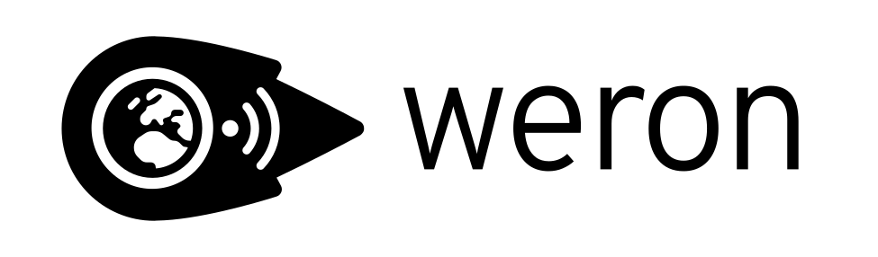

# weron

Overlay networks based on WebRTC.

⚠️ weron has not yet been audited! While we try to make weron as secure as possible, it has not yet undergone a formal security audit by a third party. Please keep this in mind if you use it for security-critical applications. ⚠️

## Overview

🚧 This project is a work-in-progress! Instructions will be added as soon as it is usable. 🚧

## License

weron (c) 2022 Felix Pojtinger and contributors

SPDX-License-Identifier: AGPL-3.0
